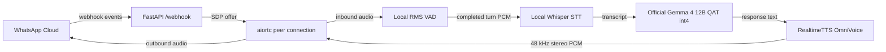
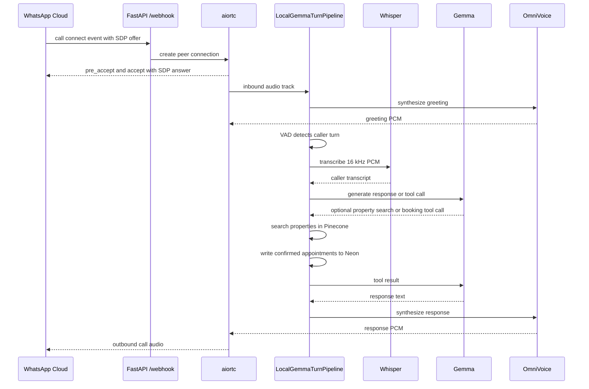

# WhatsApp Voice Bot

Voice-only WhatsApp assistant powered by local models on a GPU host.

Incoming WhatsApp text messages are intentionally ignored. The live call path uses local Whisper, official Gemma 4 12B QAT GGUF through CUDA llama.cpp, and the SerendibAI OmniVoice V2 fine-tune through RealtimeTTS. Do not add hosted LLM calls to the voice path.

## Architecture





## Main Components

| Path | Purpose |
| --- | --- |
| [`app/main.py`](app/main.py) | ASGI entrypoint. |
| [`app/api/app.py`](app/api/app.py) | FastAPI app factory and startup model prewarm. |
| [`app/integrations/whatsapp/webhook.py`](app/integrations/whatsapp/webhook.py) | Meta verification, status events, and call event dispatch. |
| [`app/integrations/whatsapp/webrtc.py`](app/integrations/whatsapp/webrtc.py) | WhatsApp SDP handling and aiortc bridge. |
| [`app/voice/agent.py`](app/voice/agent.py) | Active call task ownership and interruption counters. |
| [`app/voice/turn_pipeline.py`](app/voice/turn_pipeline.py) | Greeting, VAD, ASR, LLM, TTS, and streaming turn loop. |
| [`app/voice/tools.py`](app/voice/tools.py) | Pinecone property search and Neon appointment tools. |
| [`app/voice/pinecone_store.py`](app/voice/pinecone_store.py) | Pinecone property indexing and semantic retrieval. |
| [`app/voice/config.py`](app/voice/config.py) | Voice model settings, prompts, and turn-control constants. |
| [`app/dashboard/router.py`](app/dashboard/router.py) | Browser dashboard for active and recent call sessions. |

## Runtime Endpoints

| Endpoint | Description |
| --- | --- |
| `GET /` | Health check. |
| `GET /webhook` | Meta webhook verification. |
| `POST /webhook` | WhatsApp statuses and call events. |
| `GET /dashboard` | Call sessions dashboard. |
| `GET /dashboard/calls` | Call sessions JSON. |

## Environment

Required secrets and deployment credentials:

```bash
VERIFY_TOKEN=my_secure_verify_token_123
WHATSAPP_ACCESS_TOKEN=...
PHONE_NUMBER_ID=...
DATABASE_URL=postgresql://...
PINECONE_API_KEY=...
PINECONE_INDEX_NAME=homelands-properties
```

`DATABASE_URL` should point to the same Neon database used by the hosted
dashboard so call status and transcript updates remain available after the GPU
instance is terminated.

At startup, the voice runtime creates `real_estate_properties` and
`property_appointments` when needed, seeds the initial Homelands inventory for
the customer mapped to `PHONE_NUMBER_ID`, and synchronizes active property
records into the Pinecone namespace for that customer. Gemma reads property
facts only through Pinecone-backed retrieval. Confirmed viewing appointments
remain transactional records in Neon with the call ID and caller phone number.

Keep voice model paths, prompts, TTS settings, and turn-control values in [`app/voice/config.py`](app/voice/config.py). Use `.env` only for secrets and deployment credentials.

## Local Development

```bash
uv sync
bash scripts/run_local_host.sh
```

The local server listens on `http://localhost:8000`.

Useful checks:

```bash
curl -sS http://127.0.0.1:8000/
curl -sS 'http://127.0.0.1:8000/webhook?hub.mode=subscribe&hub.verify_token=my_secure_verify_token_123&hub.challenge=12345'
```

## Vast.ai Deployment

The voice runtime deployer defaults to 32 GB of GPU VRAM. The deployer selects
the cheapest compatible, verified listing that meets this floor. Use a 48 GB
GPU for training, conversion, and the first full-stack validation.

See [`docs/hosting_cost_report.md`](docs/hosting_cost_report.md) for the
measured memory, latency, disk usage, and current provider comparison.

One-command rental and setup from this repo:

```bash
./scripts/deploy_vastai.sh
```

The deployer selects the cheapest compatible verified, on-demand, single-GPU
offer with at least 32 GB VRAM and rents an 80 GB disk,
waits for SSH, then runs the setup and health checks. It terminates a host that
does not become SSH-ready within five minutes or does not complete setup within
the 30-minute startup budget. Before dependency installation, it rejects hosts
whose measured download speed is below 15 MiB/s, and tries at most three distinct
offers. Preview the current choice
without renting anything with `DRY_RUN=true ./scripts/deploy_vastai.sh`. The
`MIN_GPU_RAM_GB` override cannot be set below the 24 GB hard floor.
The selected host must also support CUDA 13 or newer.

Reproduce the Gemma 4 26B-A4B response-only LoRA run on a 48 GB CUDA host with:

```bash
uv run scripts/finetune_gemma26b.py
```

The script validates the pinned private dataset, reports training wall-clock
time separately, saves local checkpoints, pushes the final adapter to Hugging
Face, and exports the merged `Q4_K_M` GGUF used by llama.cpp.

To set up an instance that has already been rented:

```bash
REMOTE_BRANCH=<branch-name> ./scripts/setup_vastai.sh <SSH_PORT> <HOST_IP>
```

The setup script prepares `/workspace/sl-chatbot`, syncs `.env` when present, builds CUDA llama.cpp, downloads the official Gemma QAT GGUF, starts the webhook, and verifies the configured permanent webhook URL.

Manual dependency sync on the remote host:

```bash
cd /workspace/sl-chatbot
uv sync
```

Run the webhook manually:

```bash
cd /workspace/sl-chatbot
tmux kill-session -t sl-webhook 2>/dev/null || true
tmux new-session -d -s sl-webhook \
  "cd /workspace/sl-chatbot && \
   .venv/bin/uvicorn app.main:app --host 0.0.0.0 --port 8090 --env-file .env \
   2>&1 | tee run_logs/webhook.log"
```

## Verification

### LLM-only Sinhala quality evaluation

This evaluation hosts only local Gemma on a GPU. It uses an in-memory property
search and appointment service with the production tool contract, then sends the
full scripted conversation and tool traces to a separate judge model. It does not
start Whisper, OmniVoice, WebRTC, Pinecone, or Neon.

On a GPU host with the runtime environment installed:

```bash
GEMINI_API_KEY=... .venv/bin/python tests/llm_quality.py --report llm-quality-report.json
```

The stages cover Sinhala selection and continuity, property search, follow-up
context, broad-request clarification, narrowed search, incomplete booking details,
complete appointment booking, and confirmation. Every stage receives independent
language, continuity, clarification, tool, safety, booking, and quality scores.

Compile-check Python files:

```bash
find app -name '*.py' -print0 | xargs -0 python3 -m py_compile
```

Run tests:

```bash
uv run pytest -q
```

Healthy call logs should show:

```text
Received call event: connect
Inbound audio track received
Turn VAD: Speech started
Turn VAD: Speech ended
Turn transcript
Turn response
RealtimeTTS complete
```

## Logs

Main webhook log:

```bash
tail -f /workspace/sl-chatbot/run_logs/webhook.log
```

Important filtered call log:

```bash
tail -f /workspace/sl-chatbot/run_logs/important.log
```
